# Java-Masaustu-Projeler

Bu proje java EE, Hibernate, MYSQL Kullanılarak bir işletmenin bütün envanter kontrol ihtiyaçlarını gidermeyi hedefler.

Bu Projede Raporlama ve Teklif Gönderimi kısmı ile görevliydim.

Bu proje java EE, Hibernate, MYSQL Kullanılarak bir işletmenin bütün envanter kontrol ihtiyaçlarını gidermeyi hedefler.
Yazılımın Genel işleyişi;
Admin tarafından İdari İşler Sorumlusu olarak atanan kişinin/kişilerin teklif girişleri sonucu adminin onayına gider ve onay durumunda konusu geçen ürün depoya demirbaş/zimmet olarak kayıt olur.Depoya alınan ürün kişiye veya genel kullanıma sunulabilir.Raporlar kısmından ;

Şubeye Göre Demirbaş-Zimmet Raporu PDF veya Grafik olarak,
Personele Göre Demirbaş-Zimmet Raporu PDF veya Grafik olarak,
Firmanın Genele Göre Demirbaş-Zimmet Raporu PDF veya Grafik olarak,
Depodaki Ürünlere Göre Demirbaş-Zimmet Raporu PDF veya Grafik olarak,

Raporlama Yapılabilir.

Yazılımın Admin Tarafında ;

Şehirler,İl , İlçe işlemleri,
İdari İşler Sorumlusu İşlemleri
Kategori İşlemleri
Ürün İşlemleri
Teklif İzleme Onay Red işlemleri
Raporlama İşlemleri
Admin şifresi değiştirme işlemi,
Yapılabilir ...

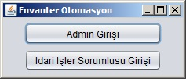

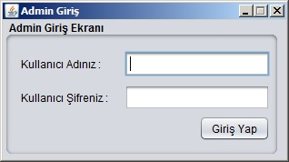

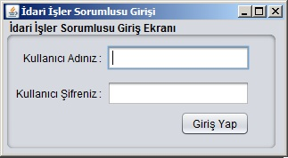

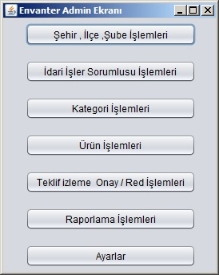

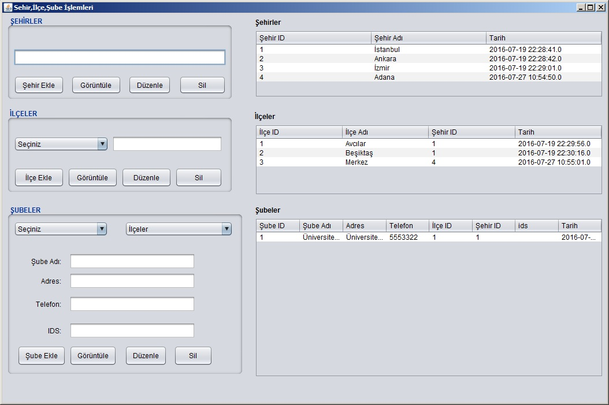

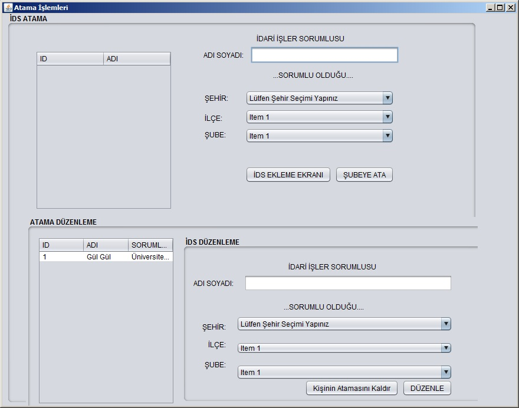

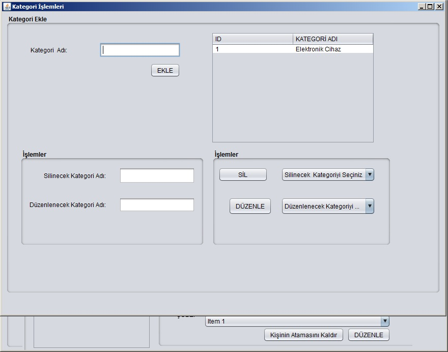

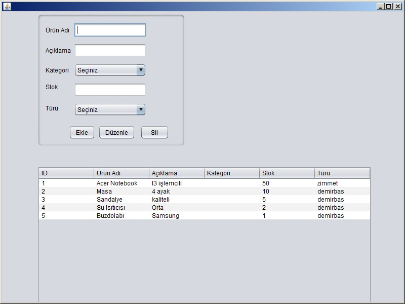

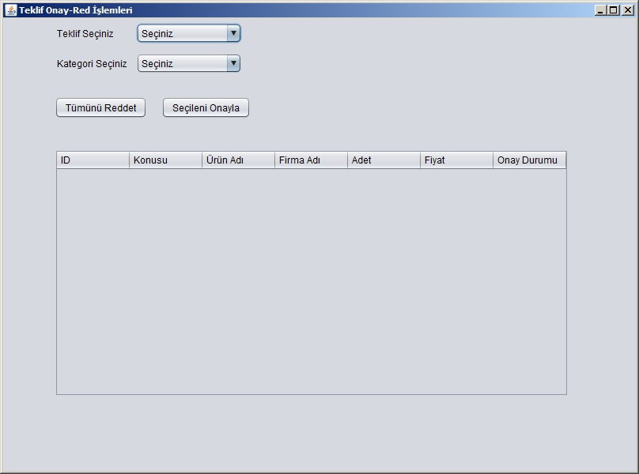

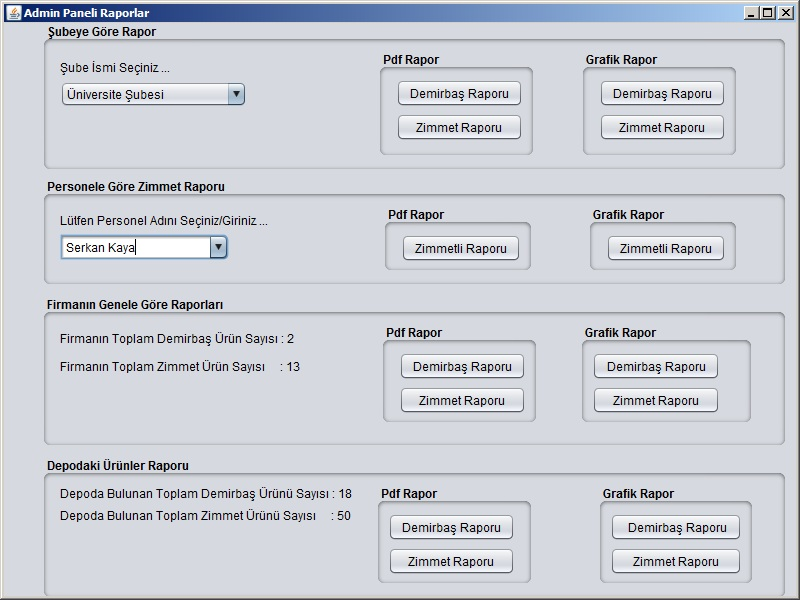

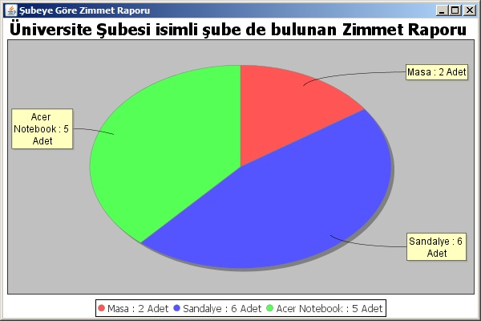

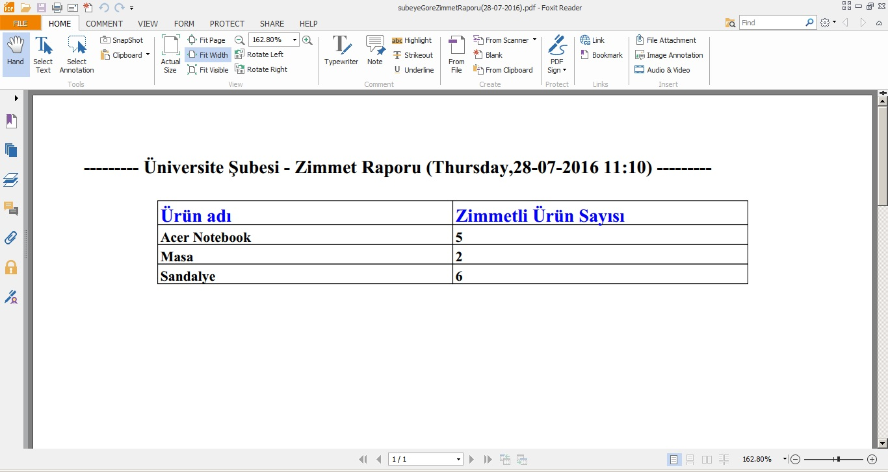

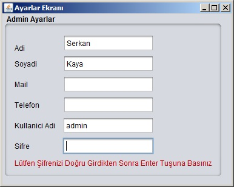

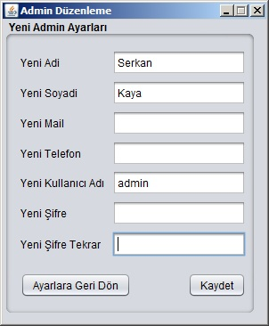

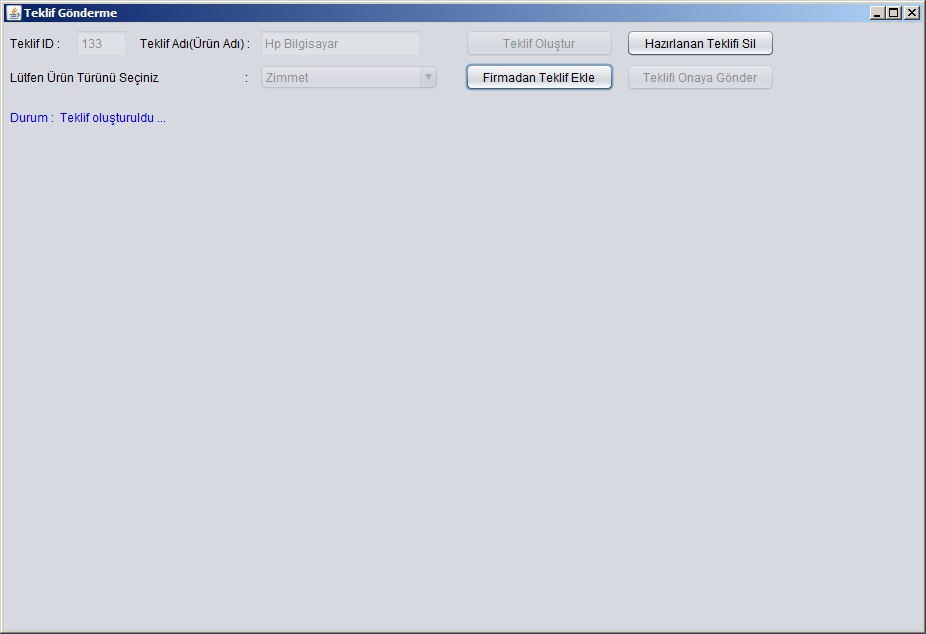

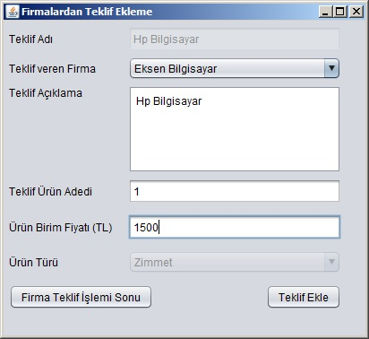

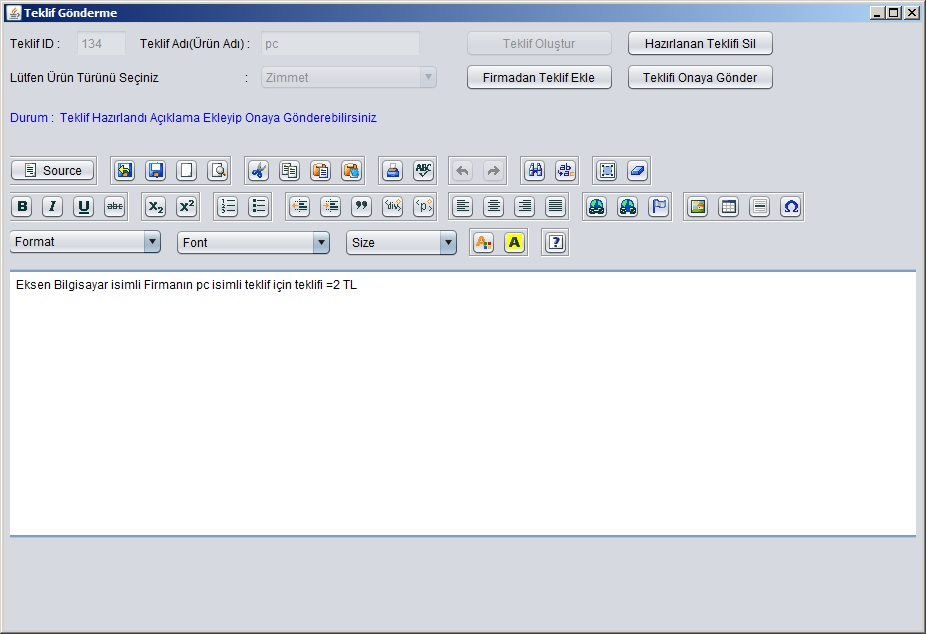

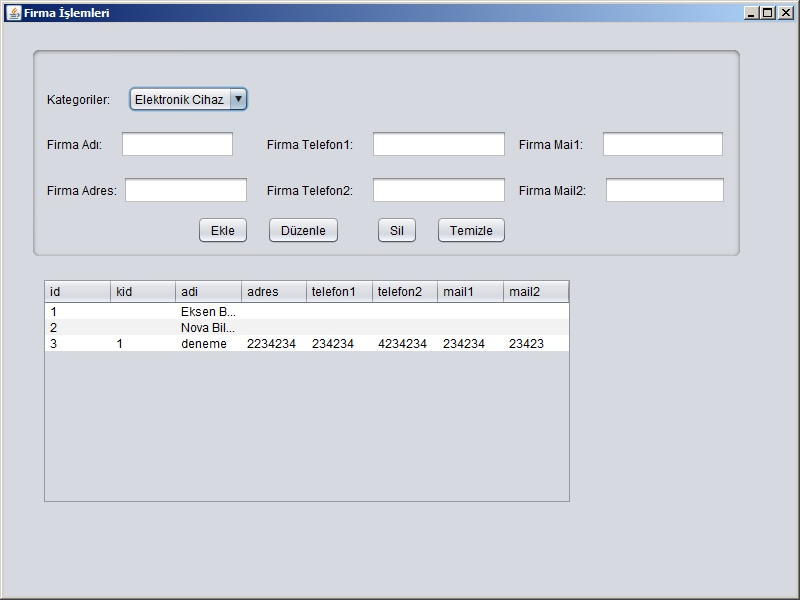

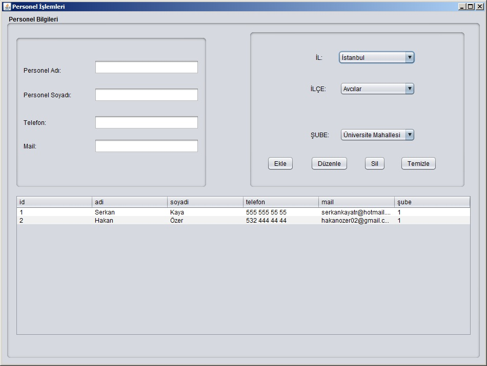

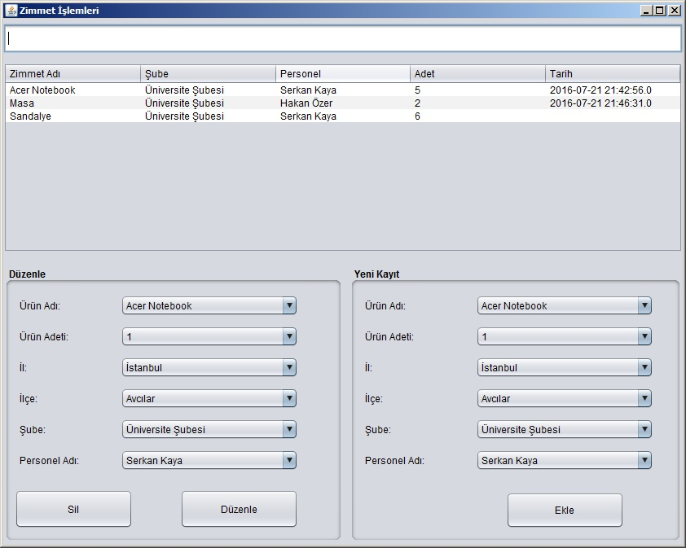
